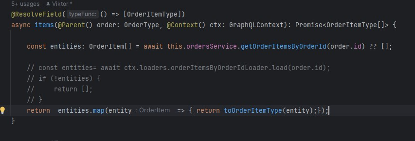
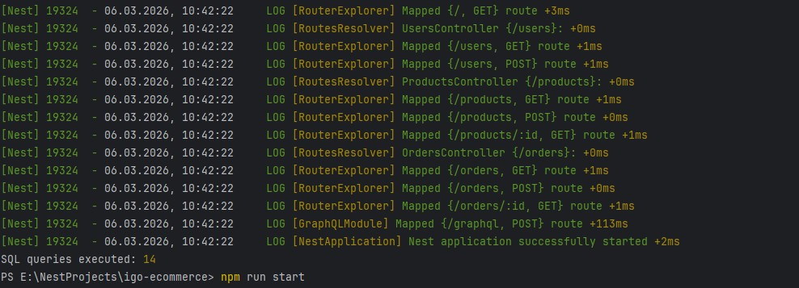
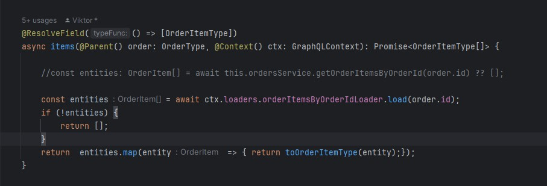
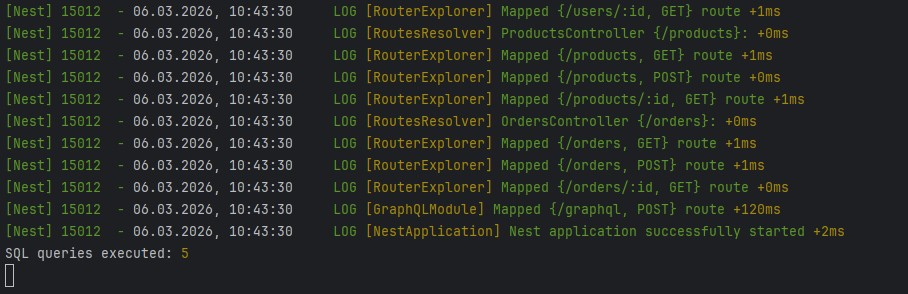

***Домашнє завдання: GraphQL для Orders + DataLoader***

**1 Який підхід schema (code-first чи schema-first) і чому?**

Обрано code-first - дозволяє працювати з типізацією, легше в розробці та підтримці

**2 Як реалізований orders query (де бізнес-логіка)?**

Бізнес логіка знаходиться в OrdersGqlService.
Жодної бізнес-логіки в резолвері, який використовує серіс.
Формат відповіді для pagination OrdersConnection { nodes, pageInfo }. (cursor based)

**3 Як зроблений DataLoader і як довели, що N+1 прибрали?**

Додав кастомний QueryCounterLogger в модуль бд
для порівняння кількості запитів до використання DataLoader:

<details>
<summary>Before optimization</summary>



</details>

<details>
<summary>After optimization</summary>



</details>

**4 Приклад GraphQL-query для перевірки:**

```
{
    orders (
        status:
        CREATED,
        limit: 5,
        dateFrom: "2026-03-04T09:00:00.000Z",
        dateTo:"2026-03-04T09:28:00.000Z",
    ){
        pageInfo {
            hasNextPage
            cursor
        }
        nodes {
            id,
            status,
            total,
            createdAt,
            customer{
                id,
                email
            },
            items {
                productId,
                product{
                    title
                }
            }
        }
    }
}
```

<details>
<summary>Example results</summary>


</details>

**5  Error handling **

Для обробки помилок додав GraphQLExceptionFilter
[GraphQLExceptionFilter Service](src/graphql/gql.exception-filter.ts)

який додана до запиту

```
@Query(() => OrdersConnection)
@UseFilters(GraphQLExceptionFilter)
async orders(@Args() args: OrdersFilterInput): Promise<OrdersConnection> {
    //throw new BadRequestException("Test bad input exception");
    return  await this.ordersService.listOrders(args);
}
```
